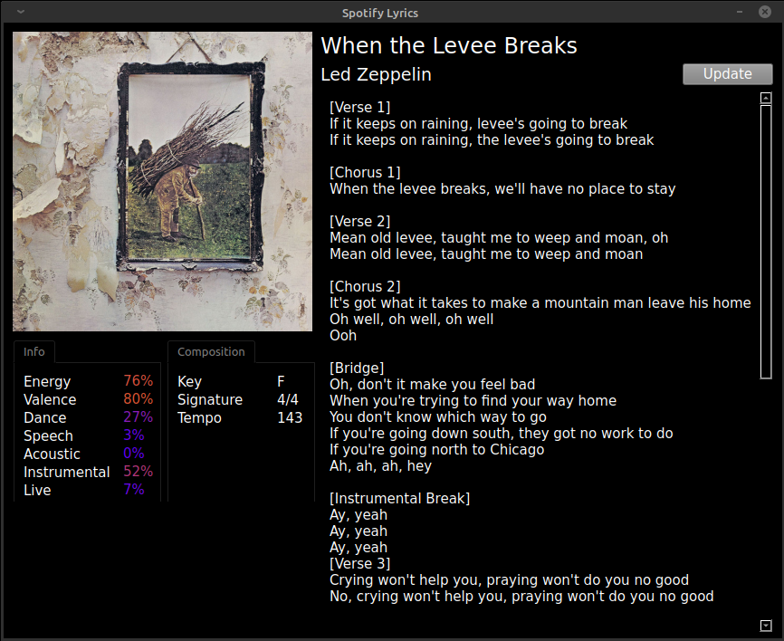

Displays lyrics and information about currently playing song on Spotify in a window.

Uses Genius.com and Spotify API, requires API keys for both of these to work *but* displays some cool metadata like the track's key and BPM in return.
Obtaining the keys (explained below) takes some extra work, but produces much more accurate and consistent results than scraping the web for information.

# How to make this work
(trust me it's worth it)

### Obtaining Spotify API Keys
Go [here (Spotify Developer Dashboard)](https://developer.spotify.com/dashboard/) and log in using your regular Spotify credentials.
Click the '*create an app*' button, write anything you want in the popup window.
In the app overview you can find your Client ID and Client Secret (after clicking '*show client secret*').
These two values need to be accessible to the script as environment variables. The easiest way to do this is to paste them into the .env file included in this repo **inside** the parentheses.
Finally, you need to add your localhost to the app's list of Redirect URIs.
Click the '*edit settings*' button on your app page and paste 'http://localhost:8080' under Redirect URIs, then press '*add*' and *'save'* to commit the changes.

### Obtaining Genius API Keys
Create a free Genius account if you don't have one already, then go [here (Genius api clients page)](https://genius.com/api-clients).
Hit the *'New API Client'* button. It doesn't matter what you enter in the form. 
When you're done, you'll have access to CLIENT ID, CLIENT SECRET, and CLIENT ACCESS TOKEN, which you will need to generate.
Copy these into the .env file just like the Spotify keys.

If you've done everything correctly and your environment fulfills the requirements, the app is good to go!

### Requirements
+charset-normalizer==2.0.6
+fuzzywuzzy==0.18.0
+lyricsgenius==3.0.1
+PyQt6==6.1.1
+PyQt6-Qt6==6.1.3
+PyQt6-sip==13.1.0
+python-dotenv==0.19.0
+spotipy==2.19.0
